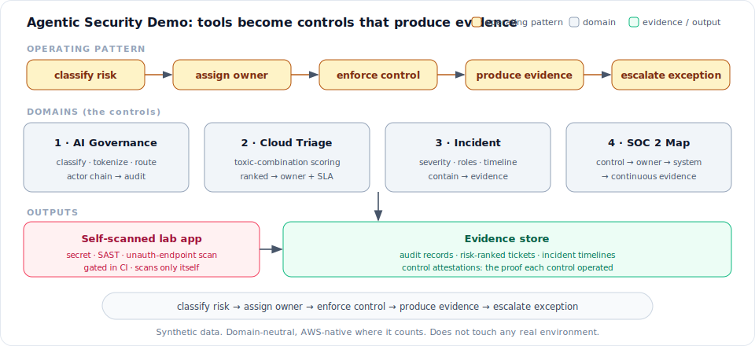

# Agentic Security Demo

> **Executive summary.** Security tools don't reduce risk until they become
> controls that produce evidence. This is a runnable, synthetic-data prototype of
> that operating model for an AI/agent platform on **AWS**: a guardrail that
> classifies and tokenizes what prompts send to a model and verifies a signed
> agent identity; AWS-native cloud-finding triage, threat detection, and incident
> response; consent checks for outbound messaging; and SOC 2 evidence wired to the
> AWS services that already emit it. One command runs every piece, each contrasting
> a "bought the tool" state with a "turned it into a control" state. The domain is
> neutral by design, with the regulated-industry hooks (PHI/PCI/PII; HIPAA, PCI
> DSS, GDPR, TCPA) called out where they apply.

Buying tools is not the same as having controls. AWS Security Hub aggregates
hundreds of findings and nobody owns them. Engineers paste secrets and regulated
data into AI tools because nothing sits in the path. SOC 2 season turns into a
screenshot hunt. A control is the thing that classifies a risk, assigns an owner,
enforces a decision, and leaves evidence, every time.

The hard, current part gets the focus: governing AI and autonomous agents over
regulated data. One guardrail sits in front of the model. It classifies the
prompt, tokenizes the sensitive parts, checks a signed per-hop agent identity, and
only then routes the request to a DPA-covered endpoint (Anthropic, OpenAI, Amazon
Bedrock). Everything else follows the same pattern on AWS: finding triage, threat
detection, incident response, and SOC 2 evidence.

## Why I built this

I run security program execution across a 450+ application portfolio at Visa: SLAs,
KPIs, and risk-acceptance over 2M+ annual findings, identity and access work across
148 apps and 5,000 service accounts, and an agentic-AI platform for defense with
human-in-the-loop gates. The same gap shows up everywhere: teams buy tools but
never wire them into controls that produce evidence. I built this to show the
operating model I'd run end to end on the AWS stack a team already has. I prototype
to understand the systems I own, so the AI-governance and agent-identity work here
is the problem I work on at Visa, scoped down to something you can run in one command.



Watch the demo: **[DEMO.md](DEMO.md)**.


> Synthetic data only. This is a prototype, not based on and not touching any real
> company's environment. Every credential is a public example value (e.g. the AWS
> documented example key and the `4111...` test card), and the scanner only ever
> scans this repo's own `lab/` app.

## Quickstart

```bash
git clone https://github.com/shishirsharma963/agenticsecuritydemo.git
cd agenticsecuritydemo
python3 demo.py            # one command, no install, no network
```

```bash
pip install -r requirements.txt && pytest -q     # 69 tests
```

Optional visual console:

```bash
pip install -r dashboard/requirements.txt
streamlit run dashboard/app.py
```

## The core: AI and agent security

### AI prompt/data governance (`agentic_security/governance.py`)
This sits between a developer (or an agent) and an AI tool. It reads the prompt and
labels what is in it: secret, PII (payment card via a real Luhn check, SSN),
sensitive record, customer/account context, production log, source code. Then it
acts per finding. Block a secret. Tokenize the PII. Route off an unapproved
endpoint, log the decision, open a rotation ticket. Token spend lands on a cost
center, and the run produces one audit record. Switch the guardrail off and that
same prompt goes to the model raw. Destinations are an inventory of real tools
([Anthropic](https://www.anthropic.com/), [OpenAI](https://openai.com/),
[Amazon Bedrock](https://docs.aws.amazon.com/bedrock/), Cursor); regulated data
only goes to endpoints under a data-processing agreement.

### Verifiable agent identity (`agentic_security/identity.py`)
The actor chain is not just strings. Each hop in `user -> agent -> agent` carries a
short-lived signed token scoped to the next hop. The guardrail verifies the whole
chain before it trusts the provenance it writes to the audit record, and a forged
or expired chain is blocked. The production-grade version (an STS minting RS256
JWTs, verified at a gateway that holds only the public key) is the sibling
[agentidentity](https://github.com/shishirsharma963/agentidentity) repo.

### Outbound-message consent (`agentic_security/consent.py`)
Texting customers puts you under the TCPA: prior express consent, an opt-out you
honor immediately, and contact only inside the recipient's local 8am to 9pm window.
Before a campaign goes out, every message is checked against consent, the STOP
list, and local time, then allowed or blocked with an evidence record that carries
a tokenized contact id and never the raw value. This is a regulated-industry
control, not a vertical one: the same shape covers email (CAN-SPAM, GDPR/CCPA).

## The same pattern, applied (AWS-native)

- **Cloud finding triage** (`agentic_security/triage.py`): a few hundred synthetic
  [Security Hub](https://docs.aws.amazon.com/securityhub/) findings (from
  [GuardDuty](https://docs.aws.amazon.com/guardduty/),
  [Inspector](https://docs.aws.amazon.com/inspector/),
  [Config](https://docs.aws.amazon.com/config/)). Sorting by severity buries the
  dangerous ones; scoring by toxic combination (internet-facing EC2 + sensitive S3
  data + exploitable CVE + broad IAM) surfaces the few that form a real attack
  path, each routed to an owner.
- **Incident response** (`agentic_security/incident.py`): a leaked-IAM-key scenario
  flagged by GuardDuty, declared as a structured incident with severity, roles, and
  a timestamped containment timeline (disable the key, isolate the EC2, rotate
  [Secrets Manager](https://docs.aws.amazon.com/secretsmanager/) secrets, hunt
  persistence in [CloudTrail](https://docs.aws.amazon.com/cloudtrail/)).
- **SOC 2 evidence** (`agentic_security/soc2.py`): each control mapped to an owner,
  the AWS service that already emits its evidence ([KMS](https://docs.aws.amazon.com/kms/),
  Config, Security Hub, GuardDuty,
  [IAM Identity Center](https://docs.aws.amazon.com/singlesignon/) +
  [Access Analyzer](https://docs.aws.amazon.com/IAM/latest/UserGuide/what-is-access-analyzer.html)),
  and that evidence, aiming at continuous evidence rather than audit-time screenshots.
- **Self-scanned lab + CI** (`lab/` + `agentic_security/scanner.py`): a deliberately
  insecure Flask app and its hardened twin. The scanner catches the bad app's
  secret, SQL injection, unauthenticated endpoints, and debug mode, and reports the
  good app clean. The test suite asserts that in CI, so the control proves itself
  while the build stays green.

## AppSec, detection, and cloud baseline

The same operating model, applied to the parts of the job a security lead is
measured on: anticipating, preventing, finding, and fixing.

- **Threat model** ([THREAT_MODEL.md](THREAT_MODEL.md) + `agentic_security/threatmodel.py`):
  a STRIDE model kept as data, mapped to OWASP-LLM and MITRE ATLAS. Every threat
  names the control that mitigates it, and a test fails if that control does not
  exist, so the model can't drift into paper mitigations. `gaps()` is the to-do list.
- **Pentest remediation tracker** (`agentic_security/appsec/pentest.py`): turns a
  report into owned work. Each finding gets an SLA by severity; the tracker
  surfaces what is overdue and who owns it. Remediation is the deliverable.
- **DAST** (`agentic_security/appsec/dast.py`): the dynamic half of "DAST and SAST
  in CI". Runtime checks for authentication, security headers, and stack-trace
  leakage against a target; the hardened target is clean and gates CI.
- **GuardDuty auto-response** (`agentic_security/detection/autoresponse.py`):
  detection-as-code. A finding produces a response plan (disable key, isolate
  instance, open incident). Destructive actions only fire on a known type at high
  severity; an unknown signal gets alert-only, never automated damage.
- **AI red-team guardrail** (`agentic_security/redteam.py`): the input -> model ->
  output framing. Detects prompt injection on the way in, and validates the model's
  output on the way out (leaked secrets/PII, revealed system prompt, unauthorized
  tool calls). Maps to OWASP LLM01/LLM02.
- **Connector authorization + audit** (`agentic_security/appsec/connectors.py`): for
  an internal AI app-builder. Who (user or agent) may use which connector (email,
  CRM, prod) and scope, checked per action, least-privilege, with anomalous-access
  flags and an audit record that never carries the raw principal.
- **Release-readiness gate** (`agentic_security/appsec/release_gate.py`): turns
  findings into ship / block. Critical-risk or attack-path blocks unless there is a
  documented, time-boxed risk acceptance. Risk-driven, so it composes with triage.
- **IaC secure baseline** (`agentic_security/cloud/baseline.py`): the preventive
  layer. Service Control Policies that make the insecure action impossible (can't
  stop CloudTrail, disable GuardDuty, launch without IMDSv2, leave approved
  regions) plus AWS Config rules that catch drift. Rendered to a real SCP policy
  document and Terraform; each SCP names the threat it prevents (a test checks it).

## Where this applies

The mechanisms are domain-neutral; the regulated-industry value is in the data tier
they protect:

- **Healthcare (HIPAA):** PHI in prompts and S3; the consent control maps to patient outreach.
- **Fintech / retail (PCI DSS):** cardholder data (the Luhn check), tokenization, key management.
- **Anywhere (GDPR / CCPA / TCPA):** PII handling, data-processing agreements, outbound-message consent.

## Status and limitations

A prototype. The mechanisms run and are tested; coverage is demo-grade. Production
paths for each piece:

| Area | Here | Production |
|---|---|---|
| Prompt classification | deterministic regex + Luhn | a commercial DLP engine with context models |
| Tokenization | truncated hash into an in-memory vault | envelope encryption via AWS KMS + format-preserving tokens in a separate service |
| Agent identity | per-hop HMAC-signed tokens, verified in-process | RS256 JWTs via an STS and a verifying gateway (see agentidentity) |
| Cloud triage | additive weights, synthetic findings | Security Hub attack paths / graph reachability with EPSS and data-sensitivity tiers |
| Scanner | line regex + a decorator check | a real SAST/DAST tool (e.g. Amazon Inspector / CodeGuru) in CI |

The choices and trade-offs are recorded in **[DECISIONS.md](DECISIONS.md)**; every
control is mapped to NIST CSF and SOC 2 in **[CONTROLS.md](CONTROLS.md)**.

## Layout

```
demo.py                     one-command CLI: every domain, bad vs good
agentic_security/
  governance.py             AI prompt/data guardrail
  identity.py               per-hop signed agent identity (verifies the chain)
  consent.py                TCPA outbound-message consent guardrail
  triage.py                 AWS finding risk scoring + generator
  incident.py               incident lifecycle + evidence
  soc2.py                   control -> owner -> AWS service -> evidence map
  scanner.py                secret + SAST static scanner
  threatmodel.py            STRIDE threat model as data
  redteam.py                prompt-injection + model-output guardrail
  appsec/                   pentest tracker, DAST, connector authz, release gate
  detection/                GuardDuty auto-response (detection-as-code)
  cloud/                    IaC secure baseline (SCP guardrails + Config rules)
lab/
  app_bad.py / app_good.py  insecure vs hardened target for the scanner
data/                       seeded synthetic findings, consent + pentest records
dashboard/                  optional 5-tab Streamlit console
tests/                      69 tests (also the CI gate)
.github/workflows/          CI: tests + SAST + DAST
THREAT_MODEL.md             narrative threat model
CONTROLS.md                 control -> NIST CSF + SOC 2 map
CLOUDGOAT_WRITEUP.md        hands-on AWS pentest (SSRF -> IMDS -> S3)
```

## Why this matters: the idea

A team at this stage usually has tools, not controls. The tools light up with
findings, but nobody owns them; AI gets adopted faster than anyone can govern it;
incidents happen in chat threads; SOC 2 is a once-a-year scramble. The job of a
first security hire is not to buy more tools. It is to install one operating model
and make it run on the platform you already have:

> classify the risk, assign an owner, enforce a control, produce evidence,
> escalate the exception.

This repo is that model made concrete and small enough to run end to end. It leads
with the part that is hardest right now (governing AI and autonomous agents over
regulated data), it is honest about what is a stub versus what would scale, and it
treats evidence as a by-product of the control rather than a deliverable for an
auditor. That is the difference between owning a tool and owning a control.

## License

MIT, see [LICENSE](LICENSE).
